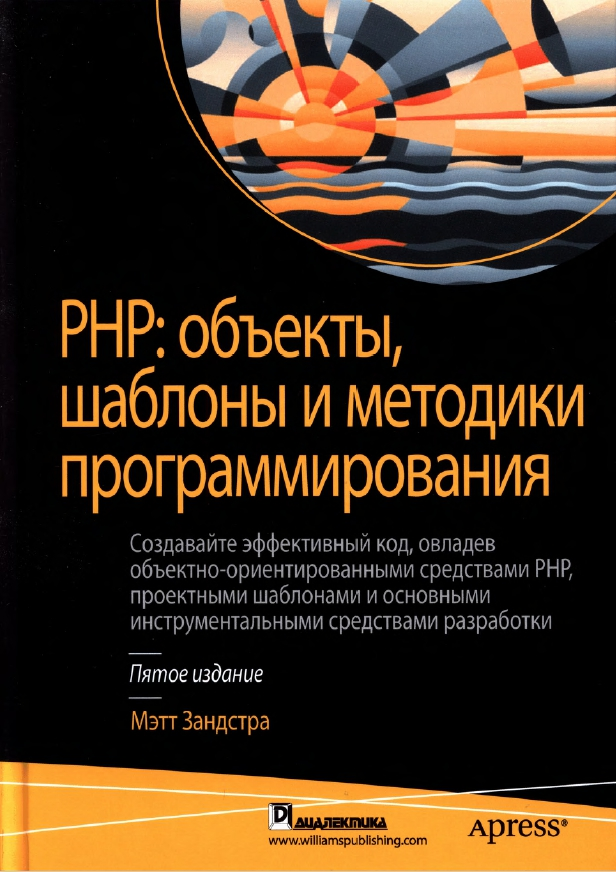

<p align="center"></p>

## About repository

This repository contains code listings from the book "Мэтт Зандстра. PHP: объекты, шаблоны и методики программирования, 
5-е изд. : Пер. с англ. - СПб. : ООО "Диалектика", 2019".

## Running examples

To run examples use the following command:

```
php index.php ch03\\batch01
```

In this command "ch03\\\batch01" is path to batch file for run.
